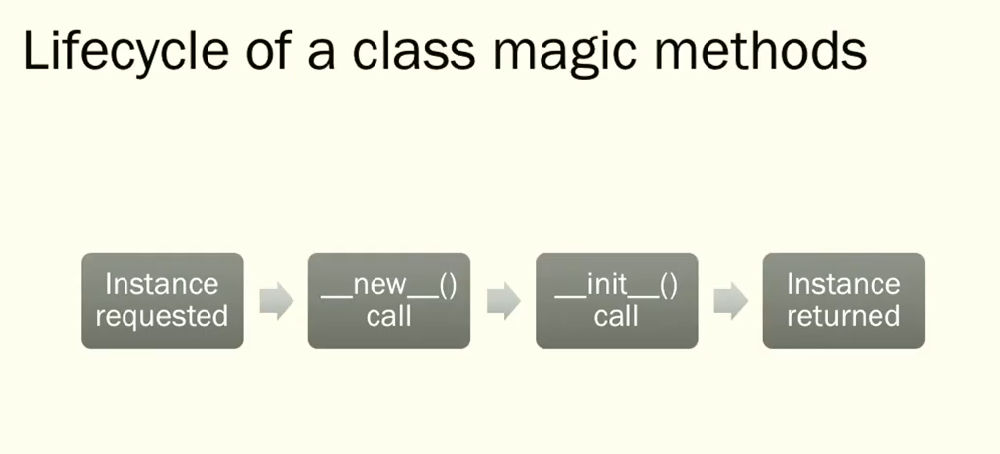
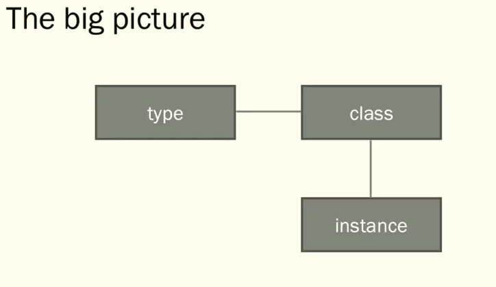
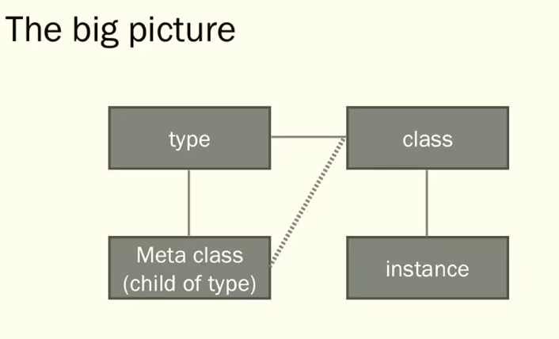
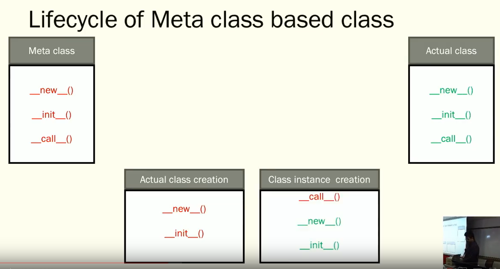
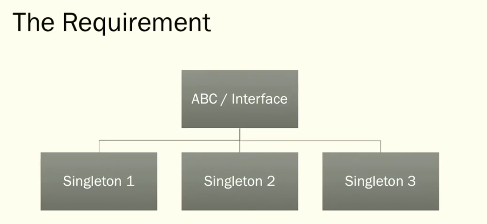

# Practical Python Design Patterns - PyCon APAC 2018

video: https://www.youtube.com/watch?v=FbMP187VNTI

## What is a class in Python

Classes - Nothing but `instances of type`. Class technically is a sugar over the native `type`.

```python
class Test:
    pass

a = Test()

print(f'a: {a}')
>>> a: <__main__.Test object at 0x7f5bd10f96a0>

print(f'type(a): {type(a)}')
>>> type(a): <class '__main__.Test'>

print(f'type(Test): {type(Test)}')
>>> type(Test): <class 'type'>

print(f'type(type): {type(type)}')
>>> type(type): <class 'type'>
```

## What is a type in Python

Create a class using a type

type(name, bases, dict)
- name - Name of the Class
- bases - Base classes of the class
- dict - The initial set of attributes and methods

```python
TestWithType = type('TestWithType', (object,), {})

print(f'type(TestWithType): {type(TestWithType)}')

ins1 = TestWithType()

print(f'type(ins1): {type(ins1)}')
```

`type` is an importtant native structure used for creating classes.

`type` defines how a class behaves in Python.

## Life cyle involved in a class - Vannila
```python
class TestClass:
    
    def __new__(cls, *args, **kwargs):
        print('new method called')
        instance = super(TestClass, cls).__new__(cls, *args, **kwargs)
        return instance

    def __call__(self, a, b, c):
        self.call_count += 1
        print('called method called')
        return a * b * c
    
    def __init__(self):
        self.call_count = 0
        super(TestClass, self).__init__()
        print('init method called')

    def get_call_count(self):
        return self.call_count
    

a = TestClass()

print(f'a(1,2,3): {a(1,2,3)}')

print(f'a.get_call_count(): {a.get_call_count()}')

#output
new method called
init method called
called method called
a(1,2,3): 6
a.get_call_count(): 1
```




Quick Recap:
- Class is an instance of `type`
- Type can be used to create dynamic classes
- Life cycle of a class creaton


## MetaClasses

- A subclass of 'type'
- Change the way the class behaves
- Commonly called `Black magic` in Python - Use it only when actually needed

Syntax:
```python
# Creating a Meta class
    class MyMetaClass(type):
        pass
# Using a Meta class
    class MyClass(metaclass=MyMetaClass):
        pass
```

```python
class MySingletonMeta(type):
    _instances = {}
    
    def __call__(cls, *args, **kwargs):
        if cls not in cls._instances:
            cls._instances[cls] = super(MySingletonMeta, cls).__call__(*args)
        return cls._instances[cls]

class MySingletonClass(metaclass=MySingletonMeta):
    def __init__(self):
        self.i = 1

a = MySingletonClass()
b = MySingletonClass()

print(type(a), id(a))
print(type(b), id(b))
```

## Lifecycle of MetaClass

```python
# Life Cycle with Metaclasses
print("My MetaClass")
class MyMetaClass(type):
    _test_attribute = 1
    def __new__(cls, *args, **kwargs):
        print("metaclass new method called")
        return super(MyMetaClass, cls).__new__(cls, *args, **kwargs)
    
    def __call__(cls, *args, **kwargs):
        print("metaclass call method called")
        return super(MyMetaClass, cls).__call__(*args, **kwargs)

    def __init__(self, *args, **kwargs):
        print("metaclass init method called")
        return super(MyMetaClass, self).__init__(*args, **kwargs)

    def test_method_1(self):
        print("MyMetaClass - Test method 1 called")

print("My Class")
class MyClass(metaclass=MyMetaClass):
    def __new__(cls, *args, **kwargs):
        print("instance new method called")
        return super(MyClass, cls).__new__(cls, *args, **kwargs)

    def __init__(self, *args, **kwargs):
        print("instance init method called")
        return super(MyClass, self).__init__(*args, **kwargs)

print("-----------------")
ins = MyClass()
print(MyClass._test_attribute)
print(MyClass.__mro__)
print(MyMetaClass.__mro__)


# Output
My MetaClass
My Class
metaclass new method called
metaclass init method called
-----------------
metaclass call method called
instance new method called
instance init method called
1
(<class '__main__.MyClass'>, <class 'object'>)
(<class '__main__.MyMetaClass'>, <class 'type'>, <class 'object'>)
```

## Big picture







The broad idea
Class Behavior changes:
- Use `__new__()` and `__init__()` of meta class

Change Behavior of instance of the class (typical object)
- Use `__call__()` of meta class


## Pattern 1: Abstract Classes

```python
from abc import ABCMeta, ABC, abstractmethod


class MyAbstractClass(metaclass=ABCMeta):
    def __init__(self):
        pass

    @abstractmethod
    def my_abstract_method(self):
        pass

# MyAbstractClass()

# TypeError: Can't instantiate abstract class MyAbstractClass with abstract methods my_abstract_method

class MyChildClass(MyAbstractClass):
    
    def __init__(self):
        pass

    def my_abstract_method(self):
        pass

mcc = MyChildClass()
print(mcc)
```

## Pattern 2: Abstract family of singleton classes


```python
from abc import ABCMeta, ABC, abstractmethod

class MySingletonABCMeta(ABCMeta):
    _instances = {}

    def __call__(cls, *args, **kwargs):
        if cls not in cls._instances:
            cls._instances[cls] = super(MySingletonABCMeta, cls).__call__(*args, **kwargs)
        return cls._instances[cls]

class MyAbstractSingletonClass(metaclass=MySingletonABCMeta):
    def __init__(self):
        pass

    @abstractmethod
    def my_abstract_method(self):
        pass

'''
>>> MyAbstractSingletonClass()

TypeError: Can't instantiate abstract class MyAbstractSingletonClass with abstract methods my_abstract_method
'''

class MyAbstractSingletonChild(MyAbstractSingletonClass):
    def __init__(self):
        pass

    def my_abstract_method(self):
        pass

a1 = MyAbstractSingletonChild()
b1 = MyAbstractSingletonChild()

print(type(a1), id(a1))
print(type(b1), id(b1))
```

## Pattern 3: Hashable Objects

```python
from collections import Hashable
from abc import ABCMeta, ABC, abstractmethod

class HashableObject(Hashable, metaclass=ABCMeta):
    def __init__(self):
        pass

    def __eq__(self, other):
        return True if isinstance(other, self.__class__) and self.get_key() == other.get_key() else False

    def __ne__(self, other):
        return not self == other

    def __hash__(self):
        return hash(self.get_key())

        @abstractmethod
        def get_key(self):
            pass

class MyHashableClass(HashableObject):
    def __init__(self, a, b, c):
        self.a = a
        self.b = b
        self.c = c
    
    def get_key(self):
        return self.a, self.b
```

## Pattern 4: Comparable Objects

```python
from collections import Hashable
from abc import ABCMeta, ABC, abstractmethod

class ComparableObject:
    def __init__(self):
        pass

    def __eq__(self, other):
        return True if isinstance(other, self.__class__) and self.__dict__ == other.__dict__ else False

    def __ne__(self, other):
        return not self == other

class MyComparableObject(ComparableObject):
    def __init__(self, a, b, c):
        self.a = a
        self.b = b
        self.c = c

c1 = MyComparableObject(1, 2, 3)
c2 = MyComparableObject(4, 5, 6)
c3 = MyComparableObject(1, 2, 3)

print(c1.__dict__)
print(c2.__dict__)


print(c1 == c2)

print(c1 == c3)
```

## Pattern 5: Pooled Objects

```python
class MyBeanMeta(type):
    _instances = {}

    def __call__(cls, *args):
        print(args)
        key = tuple((cls, args))
        if key not in cls._instances:
            cls._instances[key] = super(MyBeanMeta, cls).__call__(*args)
        return cls._instances[key]

class MyBeanClass(metaclass=MyBeanMeta):
    def __init__(self, a):
        self.a = a

bn1 = MyBeanClass(1)
bn2 = MyBeanClass(2)
bn3 = MyBeanClass(3)
bn4 = MyBeanClass(1)

print(id(bn1), id(bn2), id(bn3), id(bn4))
```

## Pattern 6: Logging using Metaclasses

```python
class MyLogger:
    def __init__(self, logger=None):
        self.logger = logger
    
    def __call__(self, func):
        def wrapper(*args, **kwargs):
            if self.logger is None:
                print(str(func) + "is called")
            else:
                self.logger.info(str(func) + "is called")
            return func(*args, **kwargs)
        return wrapper

class MyLoggingMeta(type):

    def __new__(cls, name, bases, attrs):
        for item, value in attrs.items():
            if callable(value):
                print("Function item:" + str(item), str(value), type(value))
                attrs[item] = MyLogger()(value)
            else:
                print(str(item), str(value), type(value))
        return super(MyLoggingMeta, cls).__new__(cls, name, bases, attrs)

class MyClass1(metaclass=MyLoggingMeta):
    def test_m1(self):
        pass
    
    def test_m2(self):
        pass

a = MyClass1()
a.test_m1()
a.test_m2()
```

## Pattern 7: Sealed Classes
```python
class MySealedMeta(type):

    def __new__(cls, name, bases, attrs):
        all_metaclasses = [type(x) for x in bases]
        if MySealedMeta in all_metaclasses:
            raise TypeError("Sealed class cannot be subclassed")
        return super(MySealedMeta, cls).__new__(cls, name, bases, attrs)

class MySealedClass(metaclass=MySealedMeta):
    pass

class MyChildOfSealed(MySealedClass):
    pass

# TypeError: Sealed class cannot be subclassed
```


# Reference
https://pyvideo.org/pycon-us-2013/python-3-metaprogramming.html

https://www.youtube.com/watch?v=91fv17l7trc

