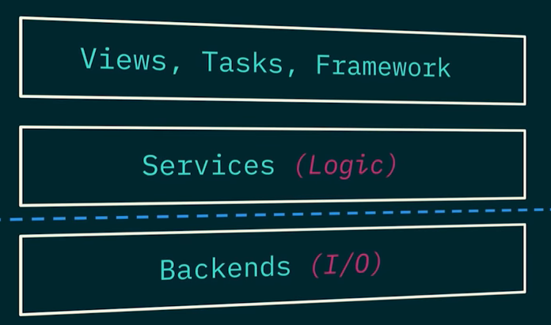
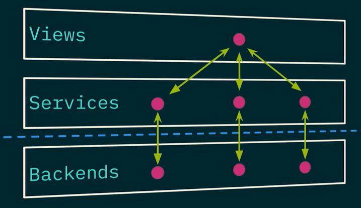
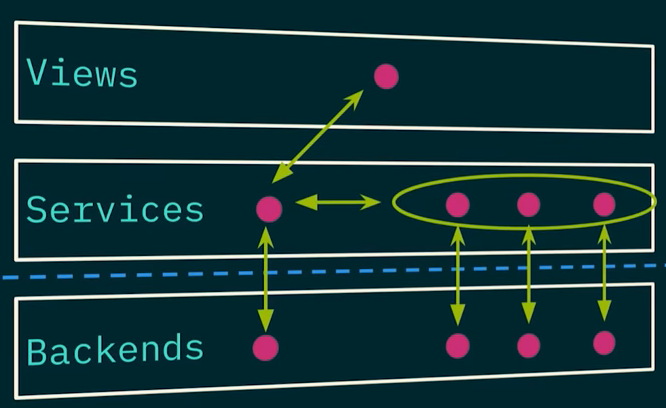
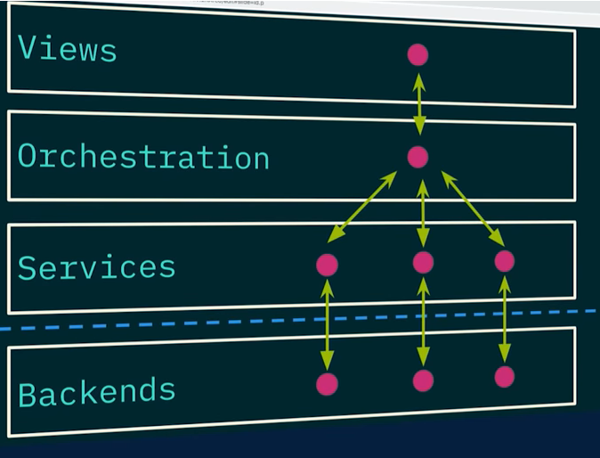
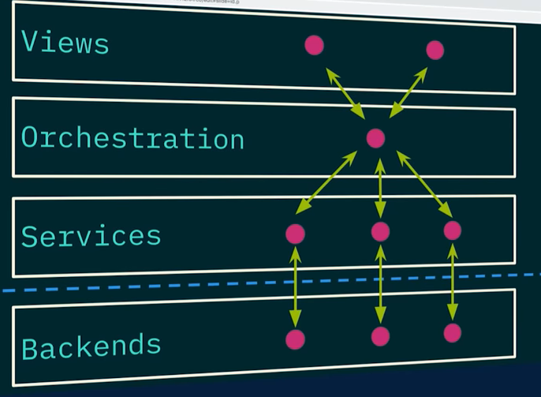

# Software Design Simplified (Alex Tucker)
Video:
https://www.youtube.com/watch?v=9bVBN7DrGx8


# Value Objects & Service Objects

## Value Objects

* Just data, no behaviour
* Useful for validation, building comparators
* Simplifies service interfaces
* Should `NOT` be ORM objects
* Could be dictionaries, but probably shouldn't be

## Service Objects

* A collection of stateless methods for operating on your data.
* Seperation of concerns centers around determining how much a method should do.

# Naming Alert

## Separation of Concerns

Domain
* FetchEmailContent
* GenerateHTMLEmail
* SendHTMLEmail

System
* I/O

  * Database
  * Filesystem
  * Network

* Logic
* Coordination
* Workflow

## Use Layers to Create System Separation of Concerns




## Advanced Patterns

* Layers Enable Composition Without "God Objects"


```python
def blog_view(request):
    blog = Blog(author=user, content="Hello!", id=1)
    spell_check_service = BlogSpellCheckService()
    blog = spell_check_service.spell_check(blog)
    blog_publish_service = BlogPublishService()
    blog = blog_publish_service.publish_blog(blog)
    blog_metrics_service = BlogMetricsService()
    blog = blog_metrics_service.collection_metrics(blog)

    return Response(blog.to_dict())
```



```python
class BlogService(object):
    def publish_blog(self, blog):
        blog = Blog(author=user, content="Hello!", id=1)
        spell_check_service = BlogSpellCheckService()
        blog = spell_check_service.spell_check(blog)
        blog_publish_service = BlogPublishService()
        blog = blog_publish_service.publish_blog(blog)
        blog_metrics_service = BlogMetricsService()
        blog = blog_metrics_service.collection_metrics(blog)
```




* Allow reuse.




Simpler Patterns
* Value Objects
* Service Objects

More Constraints
* Layers are intentional complexity
